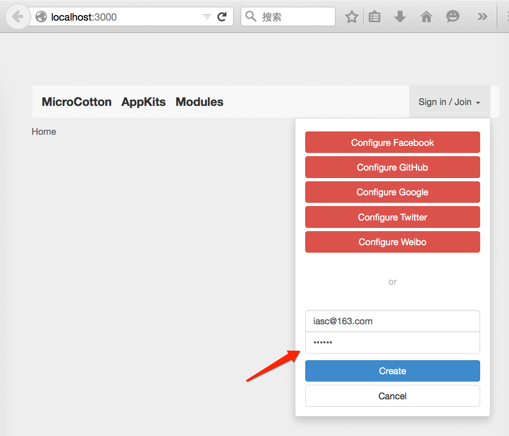

# README

# mCotton 安装使用方法

mCotton 是 server ， httpclient*.js 是访问他的Node.js客户端

## 快速安装 mCotton Server（Develop Mode）

1， 安装 meteor， 命令为： 

	curl https://install.meteor.com | sh

2. 展开 mCotton.zip ，并 进入 mCotton 目录
3. 更新meteor， 执行:  

	meteor update

4. 启动Server， 命令为 ： 

	meteor

## 创建 mCotton 的账号

1. 访问 http://localhost:3000 , 用你的邮箱注册一个账号。此账号后面还需要使用。
2. 使用此账号登陆

例如，此账号可以为：

    var useremail = "iasc@163.com", pwd = "123456";

## Wifi气象站

详情参见 [weather_station.md](docs/weather_station.md)

## 我的城市

详情参见 [my_city.md](docs/my_city.md)