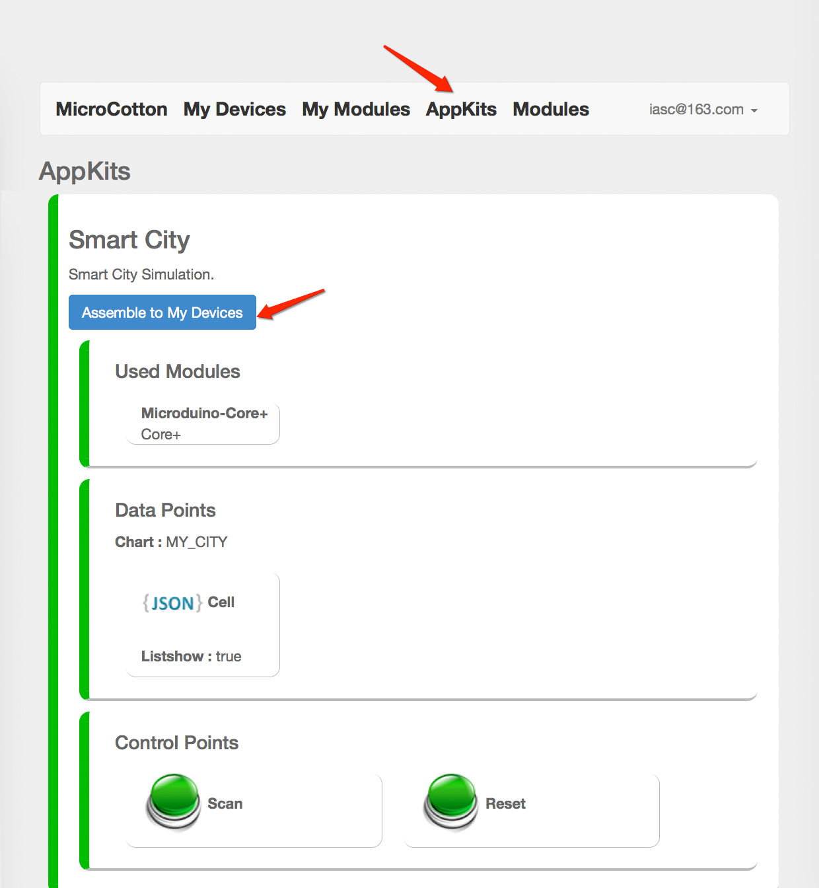
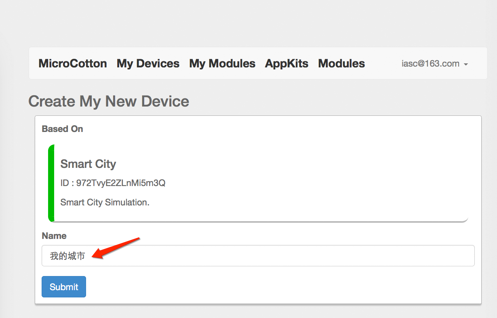
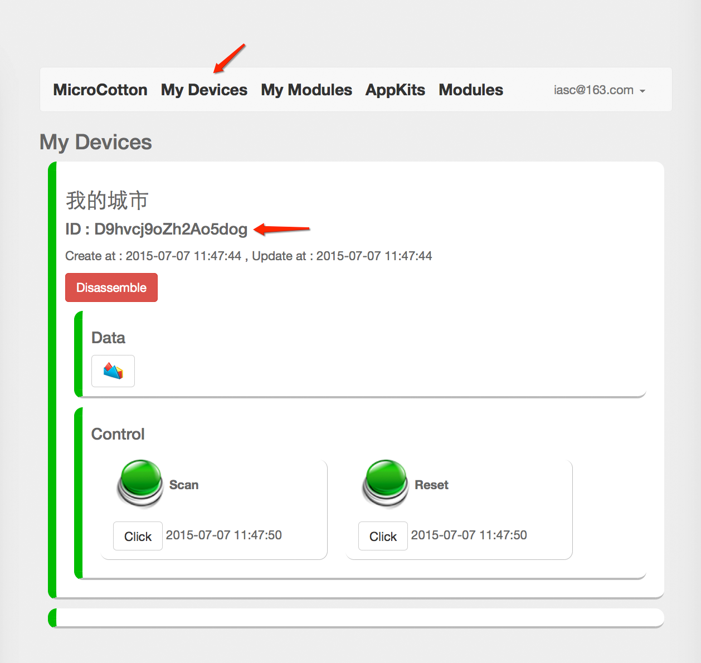
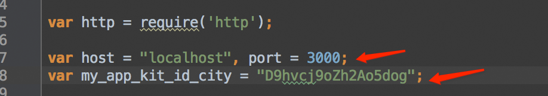
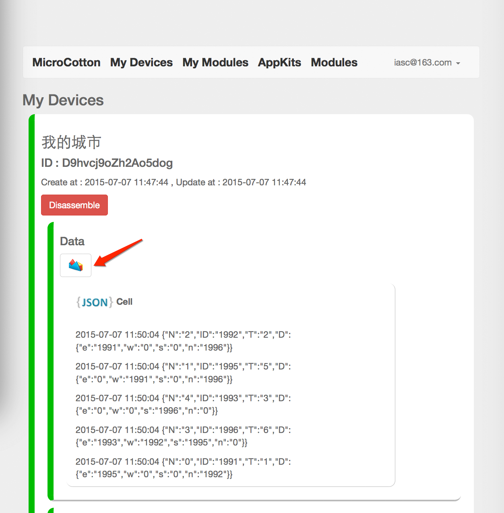
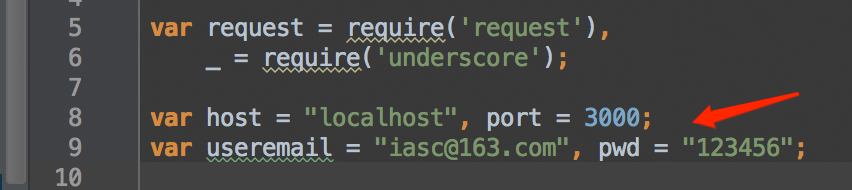
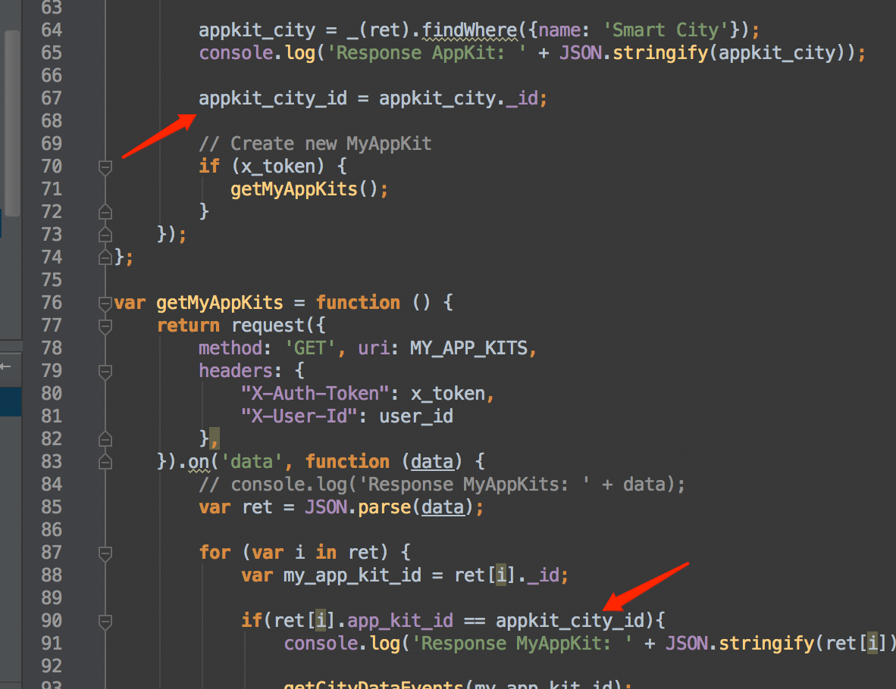
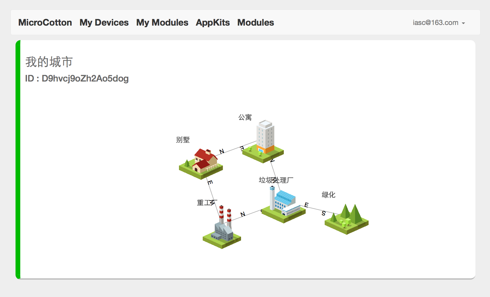

# My City

My city data upload is batch process, so should follow this spec.

## Server Address 

	http://localhost:3000
	
## Create A My City instance （on mCotton）

1. Please Click the menu of “AppKits”, and look for “Smart City” , then click the Button “Assemble to My Devices”. Give your new device a name.

	
	

2. Refresh the page of “My Devices”,  You will find a new device had been added.
3. Record the device ID.

	
	
## Upload City Info

### Get Session ID

You should get a new session id from server, before you upload Smart City scan info.

Use HTTP GET access this address:

	GET 
	/api/v1.0/sid

return 

	{"sid":1430821471498}

### Upload City Cell Info to Server (in microduino)

	POST /api/v1.0/d

Headers:

    'Content-Type': 'application/json',
    'Content-Length': Buffer.byteLength(jsonObject, 'utf8')

Post Bodys:

	{
	  "device_id": "TcWLAo99MRtxNYKRk",
	  "sid": 1430820844877,
	  "Cell" : {
	    "N": "3",
	    "ID": "1996",
	    "T": "6",
	    "D": {
	      "e": "1993",
	      "w": "1992",
	      "s": "1995",
	      "n": "0"
	    }
	  }
	}

#### device_id

After logined, user can generate a Smart City instance from mcotton server. 
Select menu AppKit, click the "Assemble" button of "Smart City", fill the name of you device.
Refresh "My Devices" tab, you can find new device had been added.  
The ID value is "device_id"

#### sid

You should get a new session id from server, before you upload Smart City scan info.

#### data_name

Must be "Cell"

#### data_value

N : Info Num 
ID: Cell ID
T : Cell Type
D : Other Cell id of east, west, south, north. 

	{
	    "N": "3",
	    "ID": "1996",
	    "T": "6",
	    "D": {
	      "e": "1993",
	      "w": "1992",
	      "s": "1995",
	      "n": "0"
	    }
	}
	
### Upload Demo Data

详情参见 Demo数据创建 示例： 
[httpclient_cotton_city_data.js](https://github.com/iascchen/mCotton_client/tree/master/my_city/httpclient_cotton_city_data.js)

修改以下内容跟你的服务器和 DeviceID 一致：

	var host = "localhost", port = 3000;
	var device_id_city = "D9hvcj9oZh2Ao5dog";
	

## Get City Info from Server (from App)

详情参见 API 示例： 
[httpclient_cotton_city.js](https://github.com/iascchen/mCotton_client/tree/master/my_city/httpclient_cotton_city.js)

修改以下内容跟你的服务器和用户账号一致：

	var host = "localhost", port = 3000;
	var useremail = "iasc@163.com", pwd = "123456";

	
示例代码实现了以下数据访问流程：

1. login
2. list 所有的 AppKits
3. 根据 AppKits 列表中名为 “Smart City” 的应用，list 所有以创建的我的城市的实例（My Devices ／ myAppKit）
4. 显示每一个我的城市的实例的数据：
	

	getCityDataEvents(device_id); // 获得最近一次城市状态上传数据
    getCityVisualization(device_id);	// 讲最近一次城市状态上传数据处理成二元图形式，用于在 Web 端用力导向图显示
     
返回数据示例：
[city_api_resp.text](https://github.com/iascchen/mCotton_client/tree/master/my_city/city_api_resp.text)

